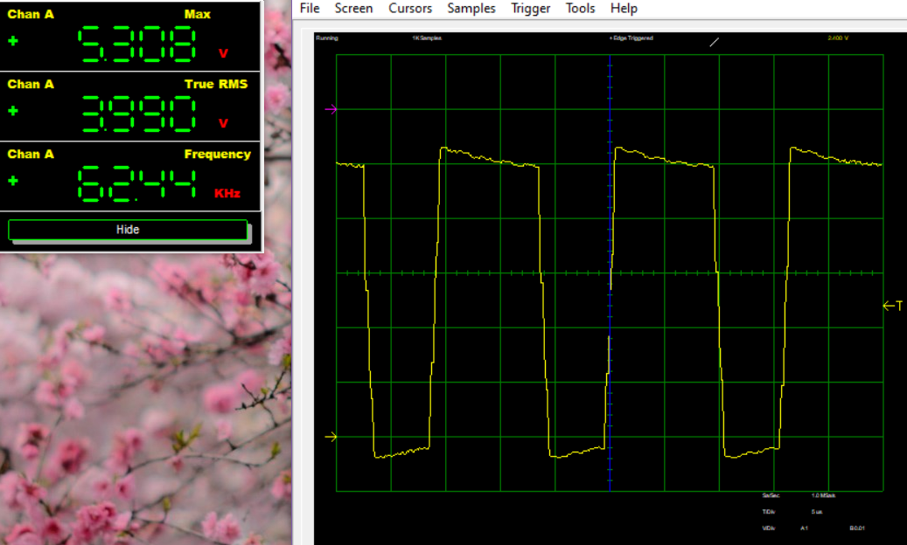

# Task 2
## Schematic

## Photo of Circuit
PWM output from the continously variable potentiometer mode set to approximately 70% duty cycle:

## Solution Explanation
### Design and Schematics
### Calculating ADC Register Values
### Converting ADC Values for OCR0A Register

