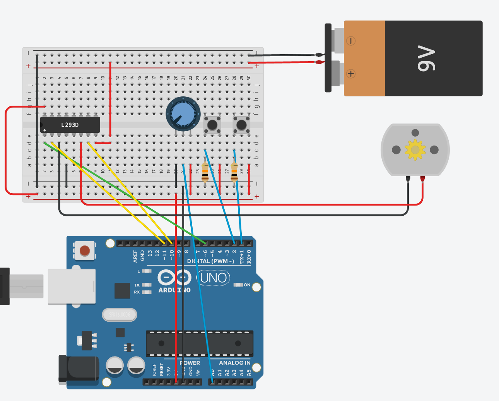
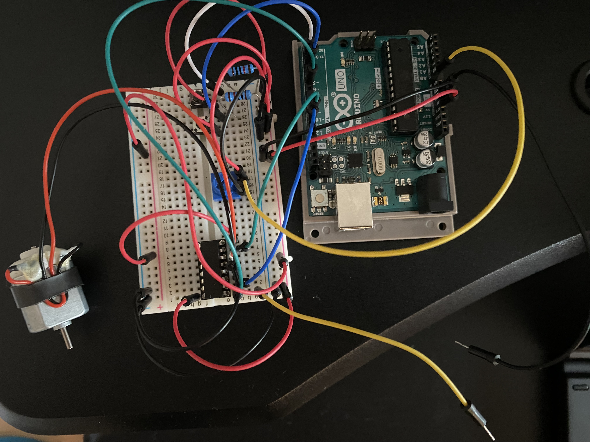

# Task 2
## Schematic

## Photo of Circuit

PWM output from the continously variable potentiometer mode set to approximately 70% duty cycle:

### Video Demonstration
Due to low battery voltage, the motor is being operated using the 5V usb passthrough supply on the Arduino, causing only the higher duty cycles to be able to spin the motor (so, only a very small range of change has been demonstrated). This could be adjusted for by scaling a smaller proportion of the duty cycle corresponding to the usable range. Due to combining this with lack of a debouncing capacitor (or other software compensation), the behaviour of the motor on the button switching task was inconsistent (and so not recorded), although an oscilloscope showed the correct switching taking places.

Potentiometer speed selection: https://youtu.be/dHCmubbeL78
## Solution Explanation
### Design and Schematics
The connection of the H-bridge was set up based on the one suggested in the lecture slides. This is with the PWM output connected to the enable pin of one channel (1,2). Then, two outputs from PORTB were connected to 1A and 2A, and alternately written high/low, switching direction of the current flow to the motor on pins 1Y and 2Y.
### Calculating ADC Register Values
ADC Register values were set manually by writing binary numbers based on the datasheet, since only one ADC function was required.

Configurations selected for in the ADMUX register were:
* Voltage reference from VCC
* Left-Justified result (to save on handling 10 bit numbers and using 16-bit variables, by instead reading the 8 most significant bits and discarding those in the lesser register)
* Mux connecting ADC to A0 pin

On the ADCSRA register, to configure the ADC itself:
* Enable ADC
* Start conversion immediately
* Enable auto-triggering (free running more, where the ADC starts taking another sample itself after completing one)
* Enabling the ADC interrupt (SEI is already set earlier in the program, so interrupts are generally already enabled)
* Set the clock prescaling to the slowest (1/128), which reduces processor load at the sacrifice of responsiveness
### Converting ADC Values for OCR0A Register
To cover the full range of PWM duty cycles, no change was needed to convert the ADC value, as the 8 most significant bits were the only ones captured by the interrupt service routine, and suitable for use directly in the 8 bit timer compare register, to cover a 0 to 100% duty cycle range.
